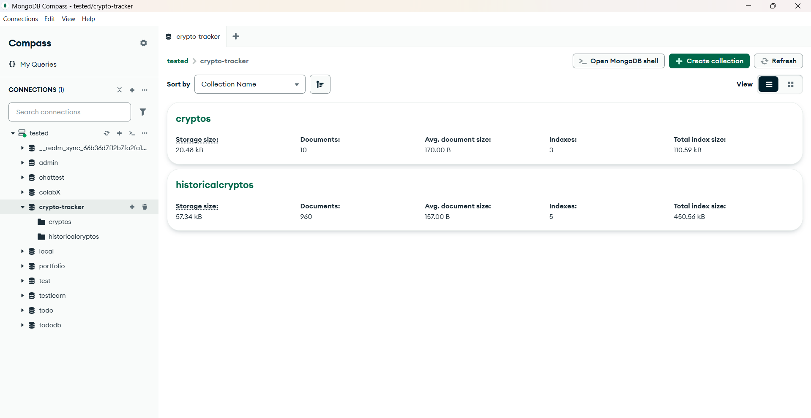
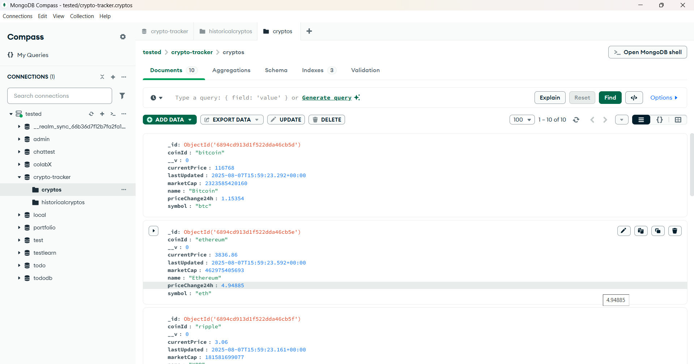
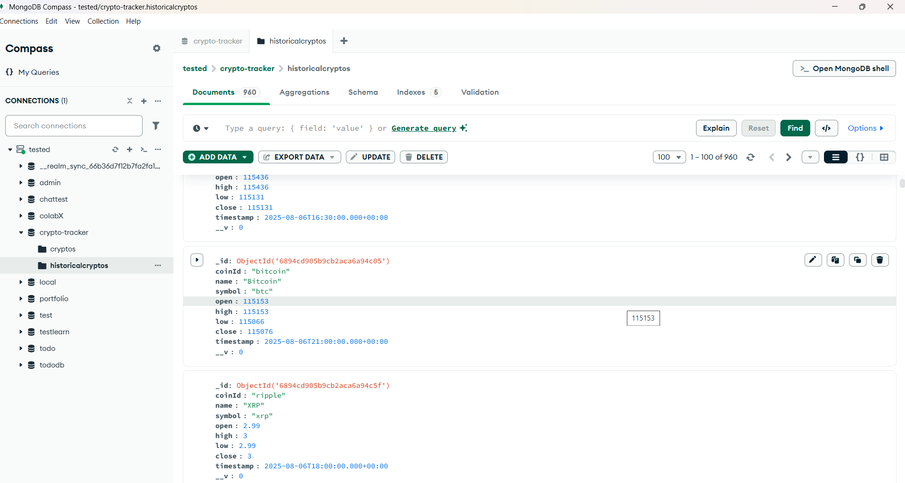
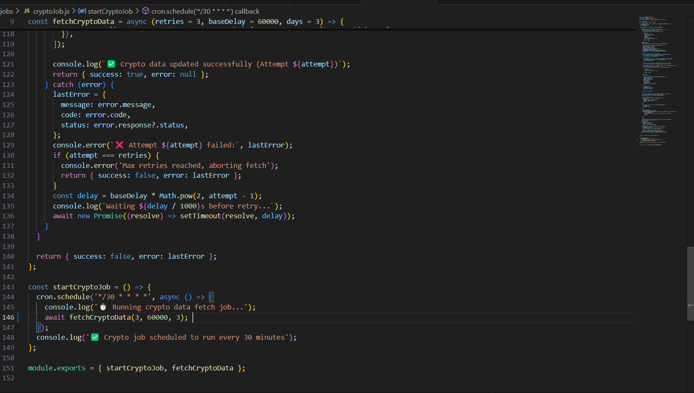
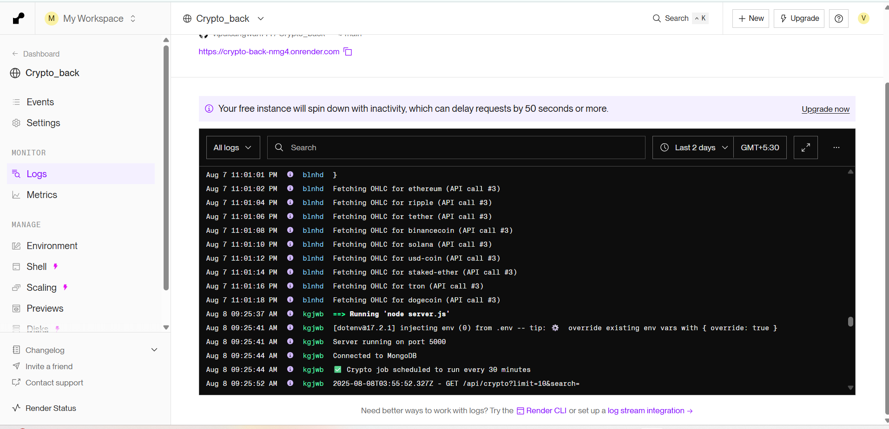

# 🚀 Crypto Tracker - Frontend

This is the **frontend client** for the Crypto Tracker application. It is built using **React**, **Tailwind CSS**, and **Axios**, and communicates with a backend API that fetches real-time cryptocurrency data from the **CoinGecko API**. It displays market data and charts in a responsive UI.

## Tech Stack

- **Frontend**: React, Tailwind CSS, Axios  
- **Backend**: Node.js, Express, MongoDB, Mongoose  
- **API**: CoinGecko API  
- **Scheduling**: node-cron  
- **Deployment**:  
  - **Frontend**: Render  
  - **Backend**: Render  
  - **Database**: MongoDB Atlas

---

## Setup Instructions

### Prerequisites

- Node.js (v16 or higher)  
- MongoDB Atlas account  
- Git

---

### Backend Setup

1. Navigate to the server directory:

   ```bash
   cd server
   ```

2. Install dependencies:

   ```bash
   npm install
   ```

3. Create a `.env` file in the `server/` directory:

   ```
   MONGODB_URI=your_mongodb_atlas_connection_string
   PORT=5000
   ```

4. Start the backend server:

   ```bash
   node server.js
   ```

---

### Frontend Setup

1. Navigate to the client directory:

   ```bash
   cd client
   ```

2. Install dependencies:

   ```bash
   npm install
   ```

3. Update the backend API URL in:

   ```
   client/src/components/CryptoTable.js
   ```

   Replace the default URL with your deployed backend URL if you're not using `localhost`.

4. Start the frontend development server:

   ```bash
   npm start
   ```

---

## Cron Job

The backend uses `node-cron` to fetch and store data every hour:

- **Location**: `server/jobs/cryptoJob.js`  
- **Schedule**: `/30 * * * *` (runs every 30 minutes)  
- **Fetches**:
  - Top 10 cryptocurrencies from CoinGecko
- **Stores data in**:
  - `Crypto` collection (latest snapshot)
  - `HistoricalCrypto` collection (hourly OHLC data)

---
## How the Cron Job Works


The backend uses **node-cron** to automate cryptocurrency data fetching every **30 minutes**.  
This ensures that the database always contains fresh market data and recent historical records without manual intervention.

**Workflow**:

1. **Trigger** – Every 30 minutes, `node-cron` executes the `cryptoJob.js` script.
2. **Fetch Data** –  
   - Calls the **CoinGecko API** to get:
     - **Top 10 cryptocurrencies** sorted by market cap (current price, market cap, 24h change).
     - **7-day OHLC (Open, High, Low, Close)** data for each coin.
3. **Store Data** –  
   - Saves **latest snapshot** in the `Crypto` collection (overwrites old data).
   - Appends **historical records** to the `HistoricalCrypto` collection with timestamps for tracking price trends over time.
4. **Error Handling** –  
   - If the API call fails, logs the error without crashing the server.
   - Retries automatically on the next scheduled run.
5. **Usage in API** –  
   - `GET /api/crypto` reads from the `Crypto` collection.
   - `GET /api/crypto/historical/:coinId` reads from the `HistoricalCrypto` collection.

**Schedule Expression**:  
```javascript
cron.schedule("*/30 * * * *", cryptoJob);
```

## Deployment

- **Frontend**: Vercel  
  🔗 URL: _https://crypto-front-8l8t.onrender.com_

- **Backend**: Render  
  🔗 API Base URL: _https://crypto-back-nmg4.onrender.com_

- **Database**: MongoDB Atlas  
  📦 Collections:
  - `Crypto` – latest market data  
  - `HistoricalCrypto` – hourly OHLC snapshots

---
## 📸 Sample Database Data

### Crypto Collection
<p align="center">
  
</p>

### Crypto Collection
<p align="center">
  
</p>

### HistoricalCrypto Collection
<p align="center">
  
</p>

---

## 📸 Cron Job Setup

Below is a screenshot of the `node-cron` job that runs every 30 minutes to fetch and store cryptocurrency data.



Here’s a sample log output showing the cron job running successfully:



---
## Author

**Vipul Sangwan**  
GitHub: [@vipulsangwan771](https://github.com/vipulsangwan771)

---

## License

This project is licensed under the **MIT License**.
